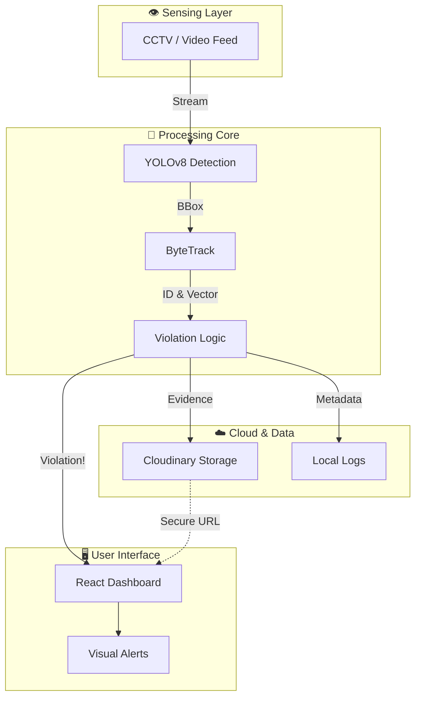
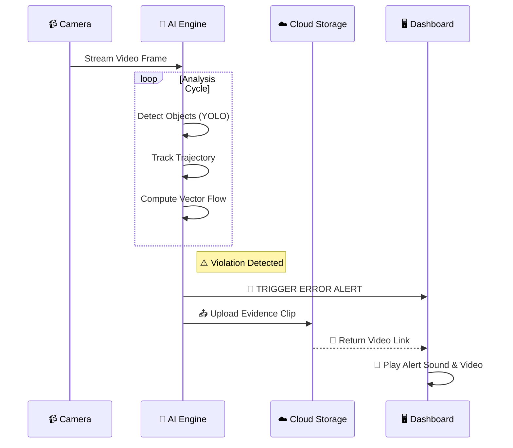

# 🚫 Wrong Way Vehicle Detection System 🚗
### *Real-Time Traffic Intelligence & Automated Violation Analysis*

> **Precision Safety System** engineered to detect, track, and report wrong-way driving incidents with forensic accuracy using Computer Vision and Deep Learning.

---

## 📖 Table of Contents
| 🔗 **Quick Links** | 🔍 **System Details** |
| :--- | :--- |
| • [Overview](#-overview) | • [Key Features](#-key-features) |
| • [Live Demo / how it Works](#-how-it-works) | • [System Architecture](#-system-architecture) |
| • [Installation Guide](#-installation--setup) | • [Technology Stack](#-technology-stack) |

---

## 🔭 Overview

Wrong-way driving represents a critical safety hazard on modern roadways. This system bridges the gap between passive monitoring and active prevention. By deploying **YOLOv8** and **ByteTrack** algorithms, the system processes live video feeds to instantaneously identify vehicles violating traffic flow direction.

### ⚡ Performance Highlights
*   **Millisecond Latency**: Real-time processing ensures immediate alerts.
*   **High-Accuracy Detection**: Robust classification of Cars, Trucks, and Bikes.
*   **Evidence Grade Logging**: Automated video clipping and secure cloud storage.

---

## 🚀 Key Features

### 🧠 Core AI Engine
*   **Object Detection**: Powered by **YOLOv8**, capable of identifying multiple vehicle classes simultaneously.
*   **Advanced Tracking**: **ByteTrack** maintains vehicle identities across frames, even during occlusions.
*   **Vector Logic**: Mathematical vector analysis determines speed and directional flow to isolate violators.

### 🛡️ Violation Response
1.  **🚨 Immediate Alerting**: WebSocket-driven dashboard updates for instant operator awareness.
2.  **📹 Evidence Capture**: Auto-clips the violation event and uploads to **Cloudinary**.
3.  **⚖️ Forensic Reports**: Generates verifiable logs with timestamps and vehicle snapshots.

---

## 🏗 System Architecture

The solution uses a reactive **Hybrid Architecture**: an asynchronous **FastAPI** Python backend for heavy computation, coupled with a **React** frontend for real-time visualization.



---

## 🔄 How It Works

A streamlined event pipeline ensures every frame is analyzed without bottleneck.



---

## 📂 Project Structure

Verified directory tree for the detection system.

```plaintext
Wrong-Way-Vehicle-Detection/
├── 📂 Code/
│   ├── 🐍 backend/         # FastAPI, OpenCV, Tracking Logic
│   │   ├── main.py         # App Entry Point
│   │   └── ...
│   └── ⚛️ frontend/        # React Dashboard & UI Logic
│       ├── src/
│       └── ...
├── 📜 Certificates/        # Project Certifications
├── 📄 wwvd_report_2025.pdf # Technical Dissertation
├── 📊 Poster_wwvd.pdf      # Presentation Poster
└── 📝 README.md            # This Document
```

---

## 💻 Technology Stack

| Component | Technology | Role |
| :--- | :--- | :--- |
| **Backend Core** |  | Logic & Orchestration |
| **API Framework** |  | Asynchronous Server |
| **Computer Vision** |  | Image Processing |
| **Frontend** |  | Reactive Interface |
| **Design System** |  | Enterprise UI Components |
| **Cloud Storage** |  | Media Hosting |

---

## ⚙️ Installation & Setup

### 1️⃣ Prerequisites
Ensure the following are installed on your system:
*   **Python 3.10+**
*   **Node.js 18+** / NPM
*   **Cloudinary Account** (Free Tier works)

### 2️⃣ Backend Configuration
```bash
# Navigate to backend
cd Code/backend

# Install dependencies
pip install -r requirements.txt

# Configure Environment (.env)
echo "CLOUDINARY_CLOUD_NAME=your_name" > .env
echo "CLOUDINARY_API_KEY=your_key" >> .env
echo "CLOUDINARY_API_SECRET=your_secret" >> .env

# Run the inference engine
python main.py
```

### 3️⃣ Frontend Dashboard
```bash
# Navigate to frontend (New Terminal)
cd Code/frontend

# Install dependencies
npm install

# Launch Development Server
npm run dev
```
> Access the dashboard at: `http://localhost:5173`

---

## 📜 Documentation

For deep technical details, please refer to the included project files:
*   [**Full Project Report**](./wwvd_report_2025.pdf)
*   [**Project Poster**](./Poster_wwvd.pdf)
