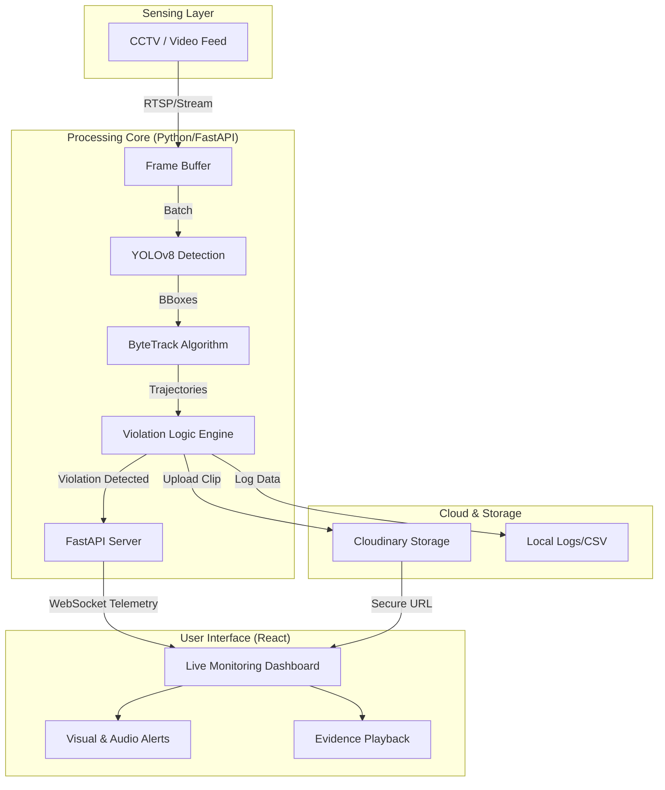
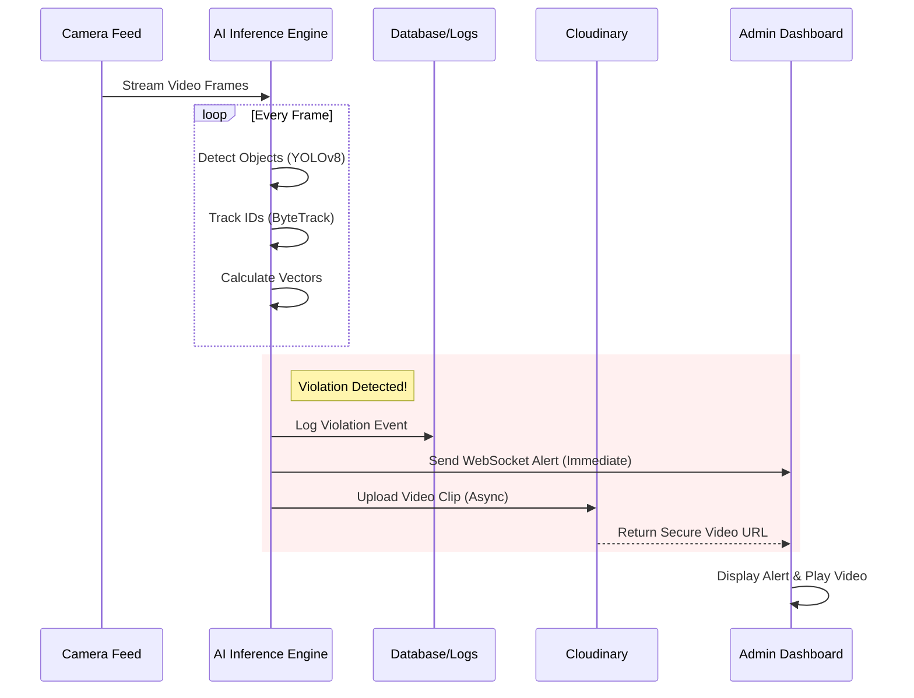

# Wrong Way Vehicle Detection System
### Enterprise-Grade Traffic Analytics & Violation Detection

**Wrong Way Vehicle Detection System** is a state-of-the-art traffic intelligence solution designed to mitigate road accidents caused by wrong-way driving. Leveraging **YOLOv8 deep learning** and the **ByteTrack** algorithm, the system provides real-time detection, tracking, and automated reporting of traffic violations with forensic precision.

This repository contains the complete source code, documentation, reports, and certifications for the project.

---

## 📑 Table of Contents

- [Overview](#overview)
- [System Architecture](#system-architecture)
- [Key Features](#key-features)
- [Project Structure](#project-structure)
- [Technology Stack](#technology-stack)
- [Installation & Setup](#installation--setup)
- [How It Works](#how-it-works)
- [Security & Compliance](#security--compliance)
- [Future Scope](#future-scope)
- [Documentation](#documentation)
- [Contact](#contact)

---

## 🔭 Overview

Wrong-way driving incidents, though infrequent, have a high fatality rate. This system addresses this critical safety gap by monitoring video feeds in real-time. It automatically identifies vehicles moving against the permitted flow of traffic, captures video evidence, and alerts operators instantly through a reactive dashboard.

### System Capabilities
-   **Precision:** Utilizes SOTA (State-of-the-Art) object detection models.
-   **Speed:** Millisecond-latency processing and alerting.
-   **Scalability:** Cloud-integrated evidence storage and lightweight edge deployment capabilities.

---

## 🏗 System Architecture

The system operates on a hybrid architecture where the heavy-lifting of computer vision is handled by an asynchronous Python backend, while the user interface acts as a real-time reactive command center.



---

## 🚀 Key Features

### 🧠 Advanced AI Core
-   **YOLOv8 Integration:** Detects vehicles (Cars, Trucks, Buses, Bikes) with high confidence.
-   **ByteTrack:** Robust multi-object tracking that persists IDs even through occlusions.
-   **Vector Analysis:** Calculates velocity and direction vectors to distinguish legal vs. illegal movements.

### 🛡️ Violation Response System
1.  **Instant Detection:** Identifies wrong-way drivers immediately.
2.  **Evidence Clipping:** Automatically cuts and saves the relevant video segment.
3.  **Cloud Sync:** Uploads high-res evidence to Cloudinary for secure, accessible storage.

### 📊 Intelligence Dashboard
-   **Live Feed Overlay:** Visual bounding boxes and lane demarcations.
-   **Real-Time Metrics:** Traffic count, active violations, and system health.
-   **Evidence Archive:** "Smart Seek" to instantly replay violation events.

---

## 📂 Project Structure

This repository is organized to separate source code from documentation and deliverables.

```plaintext
Wrong-Way-Vehicle-Detection/
├── Code/
│   ├── backend/            # Python FastAPI Server & CV Logic
│   │   ├── main.py         # Entry point
│   │   ├── tracker.py      # Tracking logic
│   │   └── ...
│   └── frontend/           # React Dashboard
│       ├── src/
│       └── ...
├── Certificates/           # Team and Project Certifications
├── wwvd_report_2025.pdf    # Full Project Report
├── Poster_wwvd.pdf         # Project Presentation Poster
└── README.md               # Master Documentation
```

---

## 💻 Technology Stack

| Domain | Tech | Purpose |
| :--- | :--- | :--- |
| **Backend** | Python 3.11+ | Core logic & Orchestration |
| **API** | FastAPI | High-performance Async API |
| **Vision** | OpenCV, YOLOv8 | Image Processing & Inference |
| **Frontend** | React 18, Vite | Reactive UI & State Management |
| **Styling** | Material-UI (MUI) | Enterprise Design System |
| **Storage** | Cloudinary SDK | Cloud Video Storage |

---

## ⚙️ Installation & Setup

Follow these steps to deploy the system locally.

### 1. Prerequisites
-   **Python 3.10+** installed.
-   **Node.js 18+** installed.
-   A free **Cloudinary** account (for video storage).

### 2. Backend Setup
Navigate to the backend directory and install dependencies:

```bash
cd Code/backend
pip install -r requirements.txt
```

**Configuration:**
Create a `.env` file in `Code/backend/` with your tokens:
```env
CLOUDINARY_CLOUD_NAME=your_cloud_name
CLOUDINARY_API_KEY=your_api_key
CLOUDINARY_API_SECRET=your_api_secret
```

**Start Server:**
```bash
python main.py
```

### 3. Frontend Setup
Open a new terminal and navigate to the frontend:

```bash
cd Code/frontend
npm install
```

**Launch Dashboard:**
```bash
npm run dev
```

The application will launch at `http://localhost:5173`.

---

## 🔄 How It Works

The system follows a strict event-driven pipeline to ensure zero-latency reporting.



---

## 🛡️ Security & Compliance

-   **Data Privacy:** Videos are processed locally; only violation clips are uploaded securely.
-   **Credential Safety:** Environment variables (`.env`) manage sensitive API keys and are excluded from version control.
-   **Audit Logs:** All violations are logged with precise timestamps for legal verification.

---

## � Future Scope

The current iteration lays a strong foundation. Future phases aim to integrate:
-   **ANPR (Automatic Number Plate Recognition):** To automatically penalize offenders.
-   **Night Vision Enhancement:** Using thermal or IR camera feeds for 24/7 operation.
-   **Edge Deployment:** Porting the inference engine to Jetson Nano/Orin devices for decentralized processing.

---

## 📜 Documentation

For more detailed information, please refer to the documents included in this repository:
-   **Project Report:** [wwvd_report_2025.pdf](./wwvd_report_2025.pdf) - Full technical dissertation.
-   **Poster:** [Poster_wwvd.pdf](./Poster_wwvd.pdf) - Visual summary of the project.

